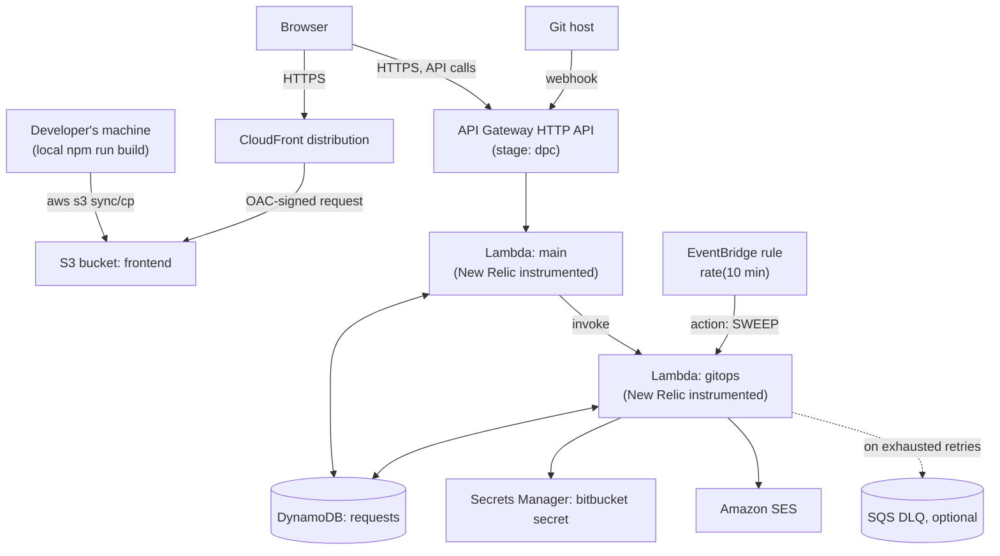

# `dpc-self-service-portal` Module — Reference

This documents a **separate Terraform module/system**, also called `dpc-self-service-portal`, distinct from the two stacks (`terraform/` org, `terraform-personal/` personal) documented elsewhere in this project. It shares the same DynamoDB-backed request/promotion design, but packages it differently — notably, it owns and deploys the frontend hosting itself (S3 + CloudFront), which neither of the other two stacks does.

This reference is built entirely from the Terraform source provided for review in this project (no live deployment, no application code for the two Lambdas was available to verify against) — anywhere a detail depends on `handler.py` internals rather than the `.tf` file, that's called out explicitly rather than assumed to match the other two stacks.

## What's different from the org/personal stacks

| | `dpc-self-service-portal` module | org / personal stacks |
|---|---|---|
| Frontend hosting | **Managed by this module** — S3 bucket + CloudFront distribution + Origin Access Control | Not managed by Terraform at all; built and hosted separately |
| API Gateway stage | Named stage `dpc`, `auto_deploy = true` | `$default` stage |
| Observability | New Relic Lambda layer + extension on both functions (env vars: `NEW_RELIC_ACCOUNT_ID`, `NEW_RELIC_LICENSE_KEY`, `NEW_RELIC_LAMBDA_HANDLER=lambda_function.lambda_handler`, extension log-forwarding flags) | Plain CloudWatch Logs only, no APM layer |
| Lambda sizing | 1024MB / 900s timeout on **both** functions | Main: 256MB/29s, GitOps: 256MB/240s (deliberately different, sized per function's job) |
| Source control host | Not specified in this snippet — only a single `bitbucket` secret resource, no Bitbucket/GitHub-specific env vars beyond `BITBUCKET_URL`/`PROJECT_KEY`/`REPO_NAME` | Bitbucket Server (org) or GitHub (personal) |
| DLQ + sweep | Same design (SQS DLQ + EventBridge `rate(10 minutes)` sweep), gated behind `enable_gitops_dlq` | Identical mechanism |

## Architecture

## Frontend hosting (S3 + CloudFront)

The frontend is **not built by Terraform** — it's built locally (`npm run build` against the frontend codebase, same as the org/personal stacks' frontend) and pushed to the S3 bucket this module provisions (`${var.project_name}-${var.environment}-frontend`) as a separate manual or CI step outside this Terraform run. This module's job is purely to provision and wire together the hosting:

- **`aws_s3_bucket.frontend`** — private bucket (`aws_s3_bucket_public_access_block` blocks all four public-access vectors); nothing in this bucket is ever reachable directly, only through CloudFront.
- **`aws_cloudfront_origin_access_control.frontend`** — SigV4-signed OAC (the modern replacement for the older Origin Access Identity), so CloudFront's requests to S3 are authenticated as CloudFront itself.
- **`aws_cloudfront_distribution.frontend`** — single S3 origin, HTTPS-only to viewers (`redirect-to-https`), GET/HEAD/OPTIONS only, compression on. `custom_error_response` maps both 403 and 404 back to `/index.html` with a `200` — the standard SPA pattern so client-side routing (React Router) works on a hard refresh or direct link to a deep route, since S3/CloudFront otherwise has no concept of those routes existing.
- **`aws_s3_bucket_policy.frontend`** — grants `s3:GetObject` to the CloudFront service principal only, conditioned (`AWS:SourceArn`) to this specific distribution, so no other CloudFront distribution in the account (or anyone else) can read from the bucket even if they discovered its name.

**Deploying a frontend update:** build locally, then sync the build output to the S3 bucket (e.g. `aws s3 sync dist/ s3://<bucket>/ --delete`) and invalidate the CloudFront distribution's cache (e.g. `aws cloudfront create-invalidation --distribution-id <id> --paths "/*"`) so viewers don't keep serving a stale `index.html`/JS bundle from cache. Neither step is automated by this Terraform module — both are a manual (or externally-scripted/CI) step after `terraform apply` has provisioned the bucket and distribution once.

**Cache behavior note:** `default_cache_behavior` sets no explicit `min_ttl`/`default_ttl`/`max_ttl`, so CloudFront falls back to its own defaults (24 hours default/max TTL under the legacy `forwarded_values` cache-behavior style used here). Combined with the deploy step above, a build pushed to S3 can take up to that long to actually reach viewers unless the cache invalidation step is included in the deploy process every time — worth confirming that's part of whatever deploy script/CI job does the `s3 sync`.

## Backend

### API Gateway routes

All routes are on the `dpc` stage (so the full path is `<api-invoke-url>/dpc/<route>`), `AWS_PROXY` into the `main` Lambda:

| Route | Purpose |
|---|---|
| `POST /request` | Submit a new whitelist request |
| `GET /listrequests` | List requests |
| `GET /requests/{request_id}` | Request detail |
| `GET /whitelist/{market_code}/{environment}` | Live whitelist read |
| `POST /requests/{request_id}/release-lock` | Admin: force-release a market lock |
| `POST /requests/{request_id}/retry-promotion` | Admin: force-retry a stuck promotion |
| `POST /bitbucket/webhook` | Inbound webhook from the git host |

This matches the route set (and, functionally, the `/dpc/...` path shape once the stage name is included) documented for the org/personal stacks' Main Lambda — the request/response payload shapes there are a reasonable guide to what this Lambda likely expects, but **that's an inference from the shared design, not something confirmed against this module's own `handler.py`**, which wasn't provided here.

CORS is configured at the API level (`cors_configuration` block) rather than per-response in Lambda code — allowed origin is exactly the CloudFront distribution's own domain, so the frontend this module deploys is the only origin permitted to call this API out of the box.

### DynamoDB

Same table design as the other two stacks: hash key `request_id`, GSIs `submitted-by-created-at` (hash `submitted_by_id`, range `createdAt`) and `market-code-created-at` (hash `market_code`, range `createdAt`), point-in-time recovery and encryption both on. Table name is `${var.project_name}-requests` — **no `${var.environment}` suffix**, unlike the frontend S3 bucket's name. If this module is deployed more than once into the same account/region for different environments (e.g. a `dev` and a `qa` deployment side by side), the DynamoDB table name — and also the Lambda function names, IAM role/policy names, and API name, none of which include `${var.environment}` either — would collide. Worth confirming whether each environment gets its own AWS account/region (which would make this a non-issue) or shares one, before deploying a second environment.

### Lambdas

Both `main` and `gitops` run `python${var.lambda_python_runtime}`, 1024MB, 900s (15 minute) timeout, with the AWS Lambda Powertools layer and a New Relic layer attached. Both set `handler = var.newrelic_lambda_handler` and `NEW_RELIC_LAMBDA_HANDLER = "lambda_function.lambda_handler"` — the New Relic layer wraps the real handler for tracing/metrics, then delegates to `lambda_function.lambda_handler` as the actual entry point.

Both functions currently share the same deployment package (`filename = var.lambda_filename`, one variable for both). If `main` and `gitops` are meant to be two different codebases (as they are in the org/personal stacks — request-handling logic vs. git-host integration logic are quite different concerns), this is worth double-checking: either they're genuinely built from the same combined package with the New Relic wrapper routing internally to the right handler per function, or this is a single shared variable that should be two (`main_lambda_filename` / `gitops_lambda_filename`) so each function ships only its own code. Neither function sets `source_code_hash`, so Terraform won't detect a code change and trigger a redeploy unless the zip's filename itself changes between applies.

The `depends_on` on each Lambda's CloudWatch log group is present in the source but **commented out** (`#depends_on = [aws_cloudwatch_log_group.main]` / `.gitops`) — as written today neither Lambda actually depends on its log group, so the known AWS/Terraform race (Lambda auto-creates a no-retention log group on first invoke, before Terraform's own log-group resource applies, causing a later `ResourceAlreadyExistsException`) is not currently guarded against. If that comment was left in deliberately as a note-to-self rather than active code, uncommenting it closes the gap.

### IAM, secrets, and email

`main`'s policy scopes DynamoDB to the table and its two GSIs, SES sending to this account/region's identities, and `lambda:InvokeFunction` to the `gitops` function specifically. `gitops`'s policy scopes `secretsmanager:GetSecretValue` to its own secret, SES the same way, and DynamoDB read/write/scan to the table and the `submitted-by-created-at` index. Both are already scoped down rather than using `Resource = "*"` — none of the earlier-flagged over-broad-`Resource` findings apply to this version.

The git-host token is stored in `aws_secretsmanager_secret_version.bitbucket`, whose `secret_string` comes directly from `var.bitbucket_secret_value` — as with any Terraform-managed secret value, this means the raw token is written into Terraform state (`terraform.tfstate`), which should be treated as sensitive (encrypted backend, restricted access) rather than a plain file, same caveat as any secret set this way.

### Resilience: DLQ + retry sweep

Identical mechanism to the org/personal stacks: an EventBridge rule fires `gitops` with `{"action": "SWEEP"}` every 10 minutes, and an optional SQS DLQ (`enable_gitops_dlq`, on by default) catches anything that exhausts the Lambda's own built-in async retries. Whether `gitops`'s own code actually implements a `SWEEP` action, and what it does when invoked with one, isn't verifiable from this Terraform alone — confirm against that Lambda's actual source.

## Open items worth confirming before this goes to production

None of these are "must fix" in isolation — they're points where this module's Terraform alone can't confirm the intended behavior, listed so they can be checked against the real deployment plan or the Lambda source:

1. **Resource names without an environment suffix** (DynamoDB table, both Lambda function names, both IAM roles/policies, the API) — a naming collision risk if this module is ever deployed more than once into the same account/region.
2. **`main` and `gitops` sharing one `lambda_filename`** — confirm this is intentional (one package, New Relic-wrapped, routing internally) rather than a leftover from copying one function's block to create the other.
3. **No `source_code_hash`** on either Lambda — a code change alone won't trigger a redeploy unless the zip filename also changes.
4. **The log-group `depends_on` lines are commented out** — decide whether to re-enable them.
5. **No explicit CloudFront TTLs** — confirm the deploy process invalidates the distribution on every frontend push, since the default 24h TTL otherwise governs how long a stale build stays visible.
6. **No webhook signature verification** on `POST /bitbucket/webhook`, same as the org/personal stacks — a known, shared gap across all three systems, not specific to this module.
