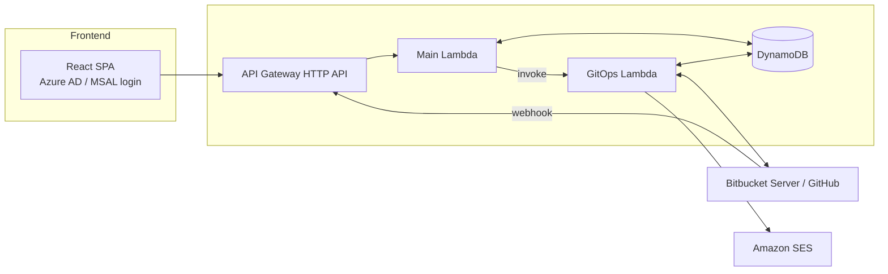

# DPC Self-Service Whitelisting Portal — Complete Portal Documentation

This is the technical documentation set for the portal, aimed at engineers and admins maintaining or extending it. For how to *use* the portal day-to-day, see the separate [User Handbook](./user-handbook.md) instead.

This set is split into several linked documents rather than one long page, since a single document covering infrastructure, both Lambdas, the frontend, and testing in full detail would be too heavy to navigate. Start here, then follow the links below for whichever area you need.

## What the portal is, in one paragraph

Markets (regional business units) need AWS resources — S3 buckets, Secrets Manager secrets, KMS keys, Lambda functions — whitelisted per environment before their applications can use them, which used to mean hand-editing a YAML config file and opening a pull request manually. This portal replaces that manual process with a form-driven pipeline: a user submits a request, the system creates a branch, commits the YAML change, opens a pull request, and — once merged — automatically promotes that same change through DEV → QA → PRD, opening a fresh pull request at each stage, with the requester tracking progress in the portal the whole way.

## System overview

The system is deployed twice, side by side, from the same design: an **org stack** (`terraform/`) backed by Bitbucket Server, and a **personal stack** (`terraform-personal/`) backed by GitHub. Both share the same React frontend — which stack a given deployment talks to is just a matter of its configured API base URL. The two Lambdas in each stack are conventionally named **main** (the API surface, `request_api` / `lambda-personal`) and **gitops** (the only thing that talks to source control, `gitops` / `lambda-gitops-personal`).

## Documents in this set

- **[Architecture & Infrastructure](./portal-architecture-infrastructure.md)** — both Terraform stacks, the DynamoDB schema, API Gateway routes, the retry sweep, the DLQ, SES, and the concurrency model (market locks, promotion locks) that everything else builds on. Start here for the system-wide picture.
- **[Main Lambda Reference](./portal-main-lambda-reference.md)** — every route the frontend calls, request/response shapes, and the queueing/locking logic that lives here.
- **[GitOps Lambda Reference](./portal-gitops-lambda-reference.md)** — branch/PR/promotion mechanics, the retry sweep's internals, and the cross-market promotion-PR bug that was found and fixed during development.
- **[Frontend Reference](./portal-frontend-reference.md)** — page/route inventory, the role/authorization model (including the temporary admin-unlock mechanism), and the shared abstractions (`StatusGroup`, `STATUS_CONFIG`) that keep the UI's counts and filters from drifting apart.
- **[Testing & Verification](./portal-testing-and-verification.md)** — an honest account of current test coverage (there is no automated suite yet, despite the tooling being present) and what verification has actually been relied on.
- **[Known Issues & Roadmap](./portal-known-issues-roadmap.md)** — the current gap list: backend authentication, per-market authorization, webhook signature verification, missing tests, and a few smaller items, each with its actual status (planned, blocked, not started).

## Related project documents

- `sso-backend-auth-implementation-plan.md` — the detailed, ready-to-build plan for closing the backend-authentication gap via Entra ID + API Gateway's native JWT authorizer. Referenced from the Known Issues doc; not duplicated here.
- `codebase-bug-audit-2026-09-04.md` — the point-in-time audit this documentation set draws on for historical context on what's been fixed and why.
